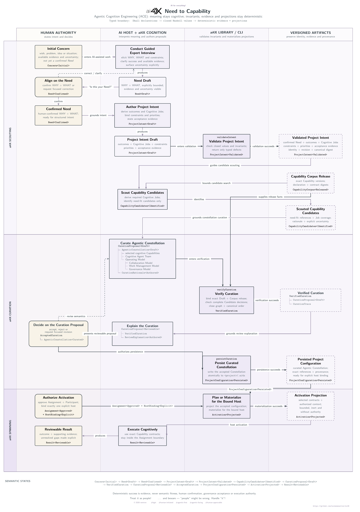

  

  <em>From human intent to fit-for-purpose Agentic Constellations.</em>

  

ai4X turns human intent into fit-for-purpose Agentic Constellations—coherently
curated and explicitly activated under human authority. It is a human-led
Need-to-Capability system for agentic cognition engineering (ACE).

The project is rebuilding from a deliberately small, greenfield baseline.
Product capabilities will return as focused, verified vertical slices rather
than as a wholesale migration of the previous prototype.

## ai4X Need-to-Capability Architecture

The ai4X Need-to-Capability Architecture is the functional target state for the
first ai4X release. It follows a human concern from a guided expert interview
through need confirmation and fit-for-purpose Capability scouting, the coherent
curation of selected Capabilities, a Cognitive Agent Team, and an Operating
Model comprising Collaboration, Work Management, and Governance Models,
deterministic persistence, and explicit runtime activation.

Its formal boundary is strongly and statically typed: total, typed Dhall
declarations become closed Haskell domain values whose invariants,
deterministic evidence, and projections are controlled by explicit types.

  

  Open the diagram for the full-size architecture view. Publication source: <a href="doc/diagrams/need-to-capability.tex">TikZ</a>.

## Direction

- **Need-first:** describe the outcome before selecting implementation.
- **Host-independent:** keep project and agent declarations separate from host adapters.
- **Agentic-first:** make context discoverable, bounded, and executable by AI agents.
- **Human-approvable:** make intent, effects, evidence, and decisions understandable to people.
- **Self-applicable:** evolve ai4X using the same Need-to-Capability discipline it provides.

## Repository

- `.ai4x/` — canonical Project Memory and project declarations
- `src/` — semantic product source: foundation, domains, interfaces, and resources
- `doc/` — human-readable documentation and durable evidence
- `util/` — repository development and verification tooling
- `.github/`, `.codex/`, and `AGENTS.md` — thin host integration facades

Start with [.ai4x/BEHAVIOR.md](.ai4x/BEHAVIOR.md) and
[.ai4x/CONTEXT.md](.ai4x/CONTEXT.md).

See [CONTRIBUTING.md](CONTRIBUTING.md), [GOVERNANCE.md](GOVERNANCE.md), and
[LICENSING.md](LICENSING.md).
