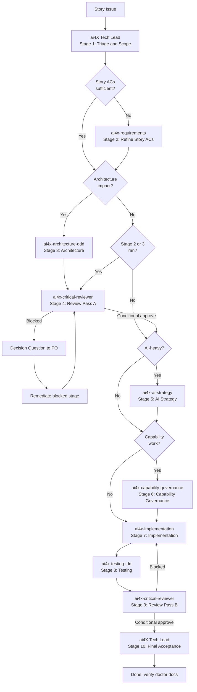

# Development Workflow

## Purpose

This workflow defines development routing for the ai4x CLI.
It applies to implementation work for curate, spawn, and doctor.

## Scope

This workflow governs development work for the ai4x CLI in this repository.

## Normative vs Informative Sources

Normative development governance for this repository lives in:

1. .github/agents/ai4x.agent.md
2. adm/gdl/dev/contracts/*
3. adm/gdl/dev/protocols/*

All artifacts under adm/gdl are normative governance artifacts.

CONTRIBUTING.md is informative contributor guidance.
It may explain process and expectations, but it is not a normative governance source.

## Command Surface Rule

All implementation work must keep the command surface explicit:

1. ai4x curate
2. ai4x spawn
3. ai4x doctor

No hidden defaults in config or CLI resolution.

## Branching and Merge Rule

1. `trunk` is the integration line.
2. Every Issue (Story or standalone) is developed on a short-lived topic branch.
3. Topic branches use the standard prefixes `feat/*`, `fix/*`, `docs/*`, `chore/*`, or `refactor/*`.
4. Every topic branch is merged to `trunk` through a pull request linked to the Issue (`closes #N`).
5. No direct commits to `trunk`.
6. Merging uses squash as standard.

## Commit Message Rule

1. Use Conventional Commits.
2. Default format: `<type>: 
`.
3. Use a scope only when it improves clarity.
4. Keep type, optional scope, and summary lowercase.
5. Keep the summary concise and behavior-oriented.

## Routing

1. CLI argument behavior changes
- update parser tests and command docs

2. Config model changes
- update global and project config contract descriptions
- keep required fields explicit

3. Runtime link behavior changes
- ensure links target project-local generated artifacts only

4. Verification changes
- keep make verify and make doctor green
- keep required repository structure versioned so fresh checkouts satisfy verification

5. GitHub automation changes
- keep GitHub Actions workflows aligned with the current repository layout and active verification entrypoints

6. Repository metadata changes
- follow the runbook in `utl/gh/RUNBOOK.md`

## Expert Team Routing

For non-trivial work, route execution through the expert team below.
This workflow executes **per Story**. Epic refinement and Story decomposition are defined in `adm/gdl/pln/protocols/workflow.md`.

1. Triage and Scope (`ai4X`) — mandatory
- takes Story scope from the parent Epic
- confirms constraints and required artifacts
- determines which stages are needed for this Story (see Stage Applicability below)

2. Requirements Refinement (`ai4x-requirements`) — conditional
- refines Story-level acceptance criteria only when the Epic ACs are too coarse for the Story scope
- skipped when the Tech Lead determines the Epic decomposition already provides sufficient Story-level ACs
- if run, updates the Story Issue with refined ACs

3. Architecture (`ai4x-architecture-ddd`) — conditional
- defines context boundaries, invariants, and alternatives with trade-offs
- skipped for scope-limited changes that do not affect module boundaries or domain invariants

4. Critical Review Pass A (`ai4x-critical-reviewer`) — conditional
- challenges requirements and architecture before implementation
- blocks progression on unresolved high-severity findings
- mandatory when Stage 2 or Stage 3 produced new artifacts; skipped when both were skipped

5. AI Strategy (`ai4x-ai-strategy`) — conditional
- validates model/tool constraints, fallback behavior, and uncertainty policy
- only when the Story involves AI/LLM behavior

6. Capability Governance (`ai4x-capability-governance`) — conditional
- validates portfolio coverage, authors or revises capabilities, performs semantic fitness checks
- only when the Story involves cognitive capability authoring, evaluation, or portfolio change

7. Implementation (`ai4x-implementation`) — mandatory
- implements approved behavior with explicit error handling and modular boundaries

8. Testing (`ai4x-testing-tdd`) — mandatory
- drives behavior-first tests and regression safeguards

9. Critical Review Pass B (`ai4x-critical-reviewer`) — mandatory
- independent review of implementation and tests before merge

10. Final Acceptance (`ai4X`) — mandatory
- final gate decision and completion check
- only this stage can issue final `approved`

### Stage Applicability

The Tech Lead determines in Stage 1 which stages are needed for the current Story.

| Stage | Applicability | Skip condition |
|-------|--------------|----------------|
| 1. Triage and Scope | Always | — |
| 2. Requirements Refinement | Conditional | Epic ACs are already sufficient for the Story scope |
| 3. Architecture | Conditional | No module boundary or domain invariant changes |
| 4. Critical Review A | Conditional | Stages 2 and 3 were both skipped |
| 5. AI Strategy | Conditional | Story does not involve AI/LLM behavior |
| 6. Capability Governance | Conditional | Story does not involve cognitive capability authoring, evaluation, or portfolio change |
| 7. Implementation | Always | — |
| 8. Testing | Always | — |
| 9. Critical Review B | Always | — |
| 10. Final Acceptance | Always | — |

### Stage Input/Output Contract

1. Requirements Refinement stage, if run, must produce an updated Requirements Pack (or confirm the Epic-level ACs are sufficient).
2. Architecture stage, if run, must consume the Requirements Pack and produce an Architecture Pack.
3. Critical Review Pass A, if run, must consume all artifacts produced by preceding stages and produce Review A Findings.
4. AI Strategy stage, if run, must consume Requirements Pack and Architecture Pack (if produced), and produce an AI Strategy Note.
5. Capability Governance stage, if run, must consume Requirements Pack, Architecture Pack (if produced), and portfolio state (`dev/cap/**`); it must produce a Capability Assessment Report and, when applicable, new or revised capability artifacts.
6. Implementation stage must consume all available upstream artifacts (Requirements Pack, Architecture Pack if produced, Review A Findings if produced, AI Strategy Note if produced, Capability Assessment Report if produced); it must produce an Implementation Pack.
7. Testing stage must consume Requirements Pack, Architecture Pack (if produced), and Implementation Pack; it must produce a Test Evidence Pack.
8. Critical Review Pass B must consume Implementation Pack and Test Evidence Pack and produce Review B Findings.
9. Missing mandatory artifacts, unresolved contradictions, or unresolved high-severity findings block progression.
10. When a conditional stage is skipped, its output artifact is marked `n/a` in the conformance record.
11. When Review B blocks and returns to Implementation, Stages 7–8 re-execute before resubmitting to Review B.

### Gate Decision Semantics

1. Specialist gate outputs are `blocked` or `conditional-approve`.
2. Final `approved` is issued only by orchestration after mandatory remediation is closed.

## Governance Glossary

This glossary defines canonical terms for workflow execution, reviews, and onboarding.

> **Planning Terms** and **Qualifier Terms** — see `adm/gdl/glossary.md` for canonical definitions.

### Gate Terms

1. Stage Gate
- A mandatory decision point between workflow stages.

2. Progression
- Advancing from one stage to the next stage.

3. Remediation
- Required corrective action before progression or final approval.

### Artifact Terms

1. Requirements Pack
- Problem statement, scope, constraints, and acceptance criteria.

2. Architecture Pack
- Boundaries, invariants, alternatives, and recommendation.

3. Review A Findings
- Pre-implementation findings and blocker status from critical review.

4. AI Strategy Note
- Model/tool limits, fallback behavior, uncertainty policy, and safeguards.

5. Capability Assessment Report
- Portfolio health verdict, gap analysis, overlap findings, and recommended portfolio actions.

6. Implementation Pack
- Behavior mapping to code, failure modes, and trade-offs.

7. Test Evidence Pack
- Behavior matrix, test strategy evidence, and regression safeguards.

8. Review B Findings
- Pre-merge findings, blocker status, and residual risk statement.

### Verdict Terms

1. blocked
- Stage cannot proceed. Blocking reasons and remediation owners are mandatory.

2. conditional-approve
- Stage may proceed only under explicit remediation conditions and tracked ownership.

3. approved
- Final acceptance verdict by orchestration only, after all mandatory remediation is closed.

## Session Conformance Check

For non-trivial work, the orchestrator must execute the session conformance check defined in `adm/gdl/dev/protocols/development-conformance.md`:

1. before implementation starts
2. before final acceptance/merge

The conformance record must include artifact presence, coherence/testability status, explicit gate decision, blocker list, and remediation ownership.

## Artifact Persistence

Artifacts produced during workflow execution persist as follows:

| Artifact | Persistence location |
|----------|---------------------|
| Idea | `adm/pbl/*.md` (temporary, deleted after Epic promotion) |
| Requirements Pack (Epic-level) | GitHub Epic Issue body |
| Story-level ACs | GitHub Story Issue body |
| Architecture Pack | Chat session (referenced in PR description for traceability) |
| Review A/B Findings | Chat session (blocking findings summarized in PR description) |
| AI Strategy Note | Chat session (referenced in PR description when applicable) |
| Capability Assessment Report | Chat session (referenced in PR description when applicable) |
| New/Revised Capability Artifacts | `dev/cap/**` in topic branch |
| Implementation Pack | Code in topic branch + PR description |
| Test Evidence Pack | Test files in topic branch + CI results |
| Conformance Record | Chat session (summary in PR description) |

For cross-session traceability, the PR description must reference the parent Story Issue and summarize key artifacts.

## Visual Flow

### Planning Flow (Idea → Epic → Stories)

The planning flow diagram is maintained in `adm/gdl/pln/protocols/workflow.md` (Visual Flow section).

### Development Flow (per Story)

## Completion Gate

A change is complete only if:

1. make verify passes
2. make doctor passes
3. docs affected by behavior changes are updated
4. GitHub workflow changes remain consistent with the current repository structure
5. repository metadata changes are reconciled through the metadata runbook when applicable
6. required repository structure is versioned so fresh checkouts contain the paths that verification expects
