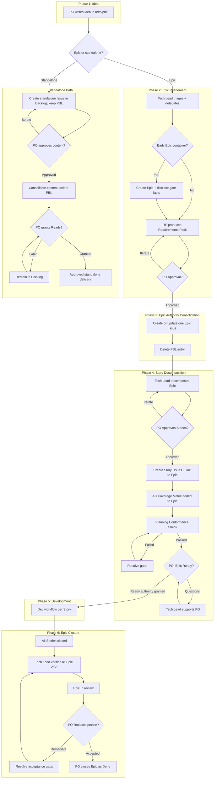

# Planning Workflow: Idea -> Work Item -> Ready -> Done

## Overview

This document defines the planning workflow for ai4X, following established Scrum/SAFe conventions adapted for a small expert team.

- **Ideas** are drafted by the Product Owner (PO) in `adm/pbl/` as a temporary exploration area.
- This workflow uses the canonical Work Item and planning-role definitions in `adm/gdl/glossary.md`.
- A PO-approved roadmap may justify an early Epic container before its Requirements Pack is complete.
- The expert team refines Epics into explicit, testable acceptance criteria, and the Tech Lead decomposes approved Epics into **Stories**.
- Development executes per Story through the 10-stage expert team workflow.
- GitHub Issues are the single source of truth once approved planning content is consolidated there. A PBL entry is deleted only after its approved content is authoritative in the Issue.
- No Issue or container authorizes implementation until its applicable Ready gate has passed.

## Operational Role Projection

> Canonical term definitions: see `adm/gdl/glossary.md` § Planning Terms. The table below states only how each canonical term participates in this workflow.

| Canonical term | Operational use | Responsible actor | PO decision |
|----------------|-----------------|-------------------|-------------|
| **Idea** | Starts temporary intake in `adm/pbl/` | PO | Selects the next planning path or rejects it |
| **Roadmap** | Orders and relates planned work | Tech Lead with PO direction | Approves the roadmap |
| **Epic** | Carries gate facts, the Requirements Pack, and AC coverage | Tech Lead / RE | Approves Requirements, decomposition, Ready, and final acceptance |
| **Story** | Carries approved PR-sized delivery scope | Tech Lead | Approves the decomposition that contains it |
| **Standalone Issue** | Uses the standalone content-promotion and Ready path | Tech Lead | Approves content, Ready, and final acceptance |
| **Task** | Records internal implementation steps | Dev team | None |

### Ownership Rules

1. The PO owns the backlog. No one changes priority without PO approval.
2. The PO writes Ideas. The expert team helps refine, but never overwrites PO intent.
3. The PO may approve a roadmap and the early creation of coherent Epic containers without granting Ready authority.
4. The RE produces the Epic definition (Requirements Pack). The PO approves it.
5. The Tech Lead proposes the Story decomposition. The PO approves it.
6. The PO owns Ready decisions and final acceptance. Issue creation never substitutes for either decision.
7. Tasks are internal to the dev team and do not require PO approval.

## Phases

### Phase 1: Idea (PO, `adm/pbl/`)

**Scope**: New ideas, vague intents, exploration, and early discussion.

**Artifact**: Markdown file in `adm/pbl/` (temporary, not versioned long-term).

**Status**: `idea`

**Duration**: Days to a few weeks. Goal: reach enough clarity to start refinement.

**Exit**: PO decides to refine the Idea into an Epic (triggers Phase 2), route it to the standalone path, or reject it.

### Phase 2: Epic Container and Refinement (Tech Lead + RE + PO)

**Trigger**: The PO submits an Idea for refinement or approves a roadmap that identifies a coherent planned Epic.

**Process**:
1. Tech Lead triages scope and delegates to Requirements Engineer.
2. The Tech Lead may create an early Epic Issue with label `epic`. Creation is optional until the Requirements Pack is approved.
3. An early Epic container includes and keeps current the canonical Epic Gate Facts Template below.
4. RE works with PO to produce a **Requirements Pack** (= Epic definition):
   - Problem statement
   - In-scope and out-of-scope
   - Constraints and assumptions
   - Acceptance criteria (EARS format)
   - Non-goals
   - Risks and open decisions
5. PO reviews and approves the Requirements Pack.

#### Epic Gate Facts Template

Copy this section into the Epic Issue body. Replace each bracketed choice with exactly one of its listed values and keep the field names unchanged.

```markdown
## Epic gate facts

- Requirements refinement: [not started | in progress | approved]
- Story decomposition: [not started | in progress | approved]
- Planning Conformance: [not run | failed | passed]
- Ready decision: [not granted | granted]
- Implementation authority: [no | yes]
```

**Board status**: `Backlog` while waiting, or `In progress` while Requirements refinement is active. Neither status grants implementation authority.

**Exit**: PO approval of the Requirements Pack. This is the Requirements approval gate.

**Completion Checklist** (Tech Lead must verify before proceeding to Phase 3):

- [ ] Requirements Pack produced (problem, scope, constraints, ACs, non-goals, risks)
- [ ] All ACs testable
- [ ] At least one rejected alternative per major design decision
- [ ] PO reviewed and approved Requirements Pack

### Phase 3: Epic Authority Consolidation (Tech Lead)

**Trigger**: PO approval of Requirements Pack.

**Action**:
1. If no early container exists, the Tech Lead creates a GitHub Issue with label `epic`.
2. If an early container exists, the Tech Lead updates it rather than creating a duplicate.
3. Issue body contains the approved Requirements Pack content and current gate facts.
4. Issue references the original PBL artifact path for traceability.
5. **Delete PBL entry** from `adm/pbl/`. PBL is temporary; GitHub Issues are the single source of truth.

**Status**: Epic Issue is open on GitHub.

**Completion Checklist** (Tech Lead must verify before proceeding to Phase 4):

- [ ] Exactly one Epic Issue exists with label `epic`
- [ ] Issue body contains approved Requirements Pack
- [ ] Gate facts are current and implementation authority remains `no`
- [ ] Issue references its PBL origin path for traceability, if one exists
- [ ] Originating PBL entry deleted from `adm/pbl/`, or marked not applicable
- [ ] Epic added to project board (`Backlog`, or `In progress` only while planning work is active)

### Phase 4: Story Decomposition (Tech Lead → PO Approval)

**Trigger**: Epic Issue exists on GitHub.

**Process**:
1. Tech Lead decomposes the Epic into Stories based on:
   - Implementable scope (one Story = one PR-sized unit of work)
   - Architecture boundaries and dependencies
   - Acceptance criteria grouping
2. Tech Lead presents the proposed Story breakdown to PO.
3. PO reviews and approves the Story decomposition.

**Action**:
1. Tech Lead creates GitHub Issues with label `story` for each approved Story.
2. Each Story Issue is a native **GitHub Sub-Issue** of the parent Epic (not a task-list or text-only relationship).
3. Each Story Issue contains:
   - Subset of acceptance criteria from the Epic
   - Implementation scope description
   - Link to parent Epic
4. Tech Lead adds an **AC Coverage Matrix** to the Epic Issue body showing which Story covers which acceptance criterion. This matrix is the authoritative traceability artifact for the Epic.
5. After the PO grants Ready, the Tech Lead updates the disclosed gate facts to `Ready decision: granted` and `Implementation authority: yes`.

**Board status**: `Backlog` while waiting, or `In progress` while Story decomposition is active. The disclosed gate facts distinguish planning activity from approved delivery.

**Exit Gate**: After the Requirements Pack and Story decomposition are PO-approved, Story Issues are created and linked, and every Epic acceptance criterion is covered, the Tech Lead must run the Planning Conformance Check (see `adm/gdl/planning-conformance.md`). Only after it passes may the Tech Lead explicitly request the PO's Ready decision for the Epic. No development work may begin until the PO transitions the Epic to Ready. The Tech Lead's prompt must offer support, not just request a binary decision. Example: *"Stories are created and Planning Conformance passed. The Epic is not yet Ready. Would you like to grant Ready authority, or is there anything else I can help you with first?"*

**Completion Checklist** (Tech Lead must verify before issuing Ready-Gate prompt):

- [ ] Story Issues created with label `story`
- [ ] All Stories linked as Sub-Issues to parent Epic
- [ ] All Stories added to project board (status: Backlog)
- [ ] AC Coverage Matrix added to Epic Issue body
- [ ] All Epic ACs covered — no gaps, no orphans
- [ ] Planning Conformance Check passed
- [ ] Gate facts state approved Requirements and Story decomposition, passed Planning Conformance, and no Ready authority yet
- [ ] PO Ready-Gate prompt issued

### Standalone Path: Content Promotion and Ready

**Trigger**: The PO selects standalone handling for an Idea or directly authorizes standalone intake.

**Process**:
1. The Tech Lead creates a standalone Issue in `Backlog` with an appropriate semantic label and copies or references the draft content.
2. If the Issue originated from `adm/pbl/`, the PBL entry remains in place while the standalone content is unapproved.
3. The PO reviews and explicitly approves the standalone scope and content, or requests iteration.
4. After content approval, the Tech Lead makes the approved content authoritative in the Issue and only then deletes the originating PBL entry.
5. The PO may grant Ready in the same decision as content approval or later. If both decisions are combined, the Tech Lead completes content consolidation and PBL deletion before recording the Issue as `Ready`.
6. No standalone implementation begins before the explicit Ready decision.

**Completion Checklist** (Tech Lead must verify before recording Ready):

- [ ] Standalone Issue has an appropriate semantic label and is on the project board
- [ ] PO explicitly approved the standalone scope and content
- [ ] Approved content is authoritative in the standalone Issue
- [ ] Originating PBL entry was retained until content approval, then deleted; or no PBL origin exists
- [ ] PO explicitly granted Ready authority

### Phase 5: Development (Story → PR → Merge)

**Trigger**: The PO grants the applicable Ready authority after all planning prerequisites pass.

**Scope**: Each approved Story follows the 10-stage expert team workflow in `crp/gov/prc/workflow.md`. An Epic container does not execute implementation stages.

**Process**:
1. Tech Lead creates a topic branch (`feat/*`, `fix/*`, etc.) for the Story.
2. The 10-stage dev workflow executes against that Story. The Tech Lead determines in Stage 1 which conditional stages apply.
3. PR is linked to the Story Issue (via `closes #N`).
4. PR description references the parent Epic and summarizes key artifacts for traceability.

**Checks**: `make verify`, applicable Doctor evidence under `crp/gov/prc/workflow.md` (Completion Gate), and GitHub Actions.

### Phase 6: Closure

**Story closure**:
1. PR merged to trunk → Story Issue auto-closes (via `closes #N`).

**Epic closure**:
1. All Story Issues linked to the Epic are closed.
2. The Tech Lead verifies that all Epic acceptance criteria are satisfied and presents the acceptance evidence to the PO without issuing final acceptance.
3. The Tech Lead moves the Epic to `In review` and explicitly requests the PO's final acceptance.
4. The PO either requests remediation or explicitly accepts the completed Epic.
5. Only after explicit PO acceptance does the PO transition the Epic to `Done` and close the Epic Issue.

**Epic Closure Checklist**:

- [ ] All native Story Sub-Issues are closed
- [ ] Tech Lead verification confirms every Epic AC is satisfied
- [ ] Acceptance evidence was presented to the PO
- [ ] Epic is `In review`
- [ ] Explicit PO final acceptance is recorded
- [ ] PO transitioned the Epic to `Done` and closed it

## Policy

| Aspect | Decision |
|--------|----------|
| **Work-item model** | Use the canonical Work Item and planning-role definitions in `adm/gdl/glossary.md`; this workflow governs their transitions and artifacts. |
| **Epic path** | Required when a coherent outcome needs coordinated Stories and Epic-level AC coverage; otherwise work may remain standalone. |
| **Early Epic container** | Allowed for a coherent Epic identified by a PO-approved roadmap. It must disclose all gate facts and grants no implementation authority. |
| **Standalone Issue path** | The Tech Lead may create labeled standalone work in `Backlog`, but retains any originating PBL entry until the PO approves the content and that content is authoritative in the Issue. Ready requires a separate explicit PO decision, which may be combined with content approval. Development stages apply per Stage Applicability rules. |
| **Story linkage** | Every Story must link to a parent Epic via GitHub Sub-Issues. |
| **AC traceability** | Every Epic must contain an AC Coverage Matrix mapping each acceptance criterion to its covering Story. |
| **PBL retention** | Temporary only. Delete after its approved content becomes authoritative in a GitHub Issue. No archive. |
| **Single source of truth** | GitHub Issues after approved planning content is consolidated there. PBL is draft-only. |
| **PO control** | PO approves Epic content, Story decomposition, Ready authority, priority, and final acceptance. |
| **Backlog priority** | Only the PO sets and changes priority. |
| **Issue labels** | Apply the semantic roles defined in `adm/gdl/glossary.md` using the label conventions in `adm/gdl/board-policy.md`. |
| **Issue linkage** | Every Story is a native Sub-Issue of its Epic. Standalone Issues have no required Epic parent. |
| **Tracking board** | GitHub Project `#3` ([link](https://github.com/users/normenmueller/projects/3)). All Epics, Stories, and standalone Issues must be tracked there. Private visibility. |

Board transitions, ownership gates, and label definitions: see `adm/gdl/board-policy.md`.

> **Note**: Mutual reference — `board-policy.md` references this document for phase definitions. Neither is subordinate; they are complementary protocols with distinct scope (planning lifecycle vs. board mechanics).

## Visual Flow

### Planning Flow (Idea -> Epic -> Stories)



## Verification

1. Run one end-to-end dry run: Idea in PBL → Epic refinement → Epic Issue → Story decomposition → Story Issues → PR → merge → Tech Lead verification → explicit PO final acceptance → PO closure.
2. Confirm an early Epic container can exist before Requirements approval and discloses all five gate facts.
3. Confirm the PBL entry is deleted only after the approved Requirements Pack becomes authoritative in the Epic Issue.
4. Confirm Story Issues are native Sub-Issues of the parent Epic.
5. Confirm neither container creation nor planning `In progress` authorizes implementation.
6. Confirm Ready is unavailable until Requirements approval, Story approval, complete AC coverage, and passed Planning Conformance.
7. Confirm traceability chain: Epic Issue -> Story Issue -> PR -> merged commit.
8. Confirm `make verify`, all applicable Doctor and Capability evidence under `crp/gov/prc/workflow.md` (Completion Gate), and GitHub Actions remain green.
9. Confirm an originating standalone PBL entry survives Issue creation and is deleted only after explicit PO content approval and authoritative consolidation.
10. Confirm standalone changes can proceed without mandatory Epic/Story linkage only after their own explicit Ready decision.
11. Confirm Epic closure requires recorded PO final acceptance and PO transition to `Done`; Tech Lead verification alone is insufficient.
12. Confirm each delivery branch starts at its exact Base Authorization OID and the current pull request has a fresh Branch and Pull-Request Scope reconciliation after creation or base/head change, before `Ready for review`, before `In review`, and at final conformance. Prior proofs are consumed, not treated as evergreen; moved-base recovery preserves the original branch and PR and retains an exact digest-bound predecessor lineage unless the PO explicitly authorizes destructive action.

## References

- `adm/gdl/board-policy.md` — Board transitions, ownership gates, and label conventions.
- `adm/gdl/planning-conformance.md` — Planning conformance check (mandatory before Ready-Gate).
- `crp/gov/prc/workflow.md` — 10-stage expert team routing, branching, commits, and completion gates.
- `utl/gh/RUNBOOK.md` — deterministic Branch and Pull-Request Scope preflight and evidence lifecycle.
- `.github/agents/ai4x.agent.md` — Tech Lead definition, interaction model, and product rules.
- `CONTRIBUTING.md` — informative contributor guidance.
