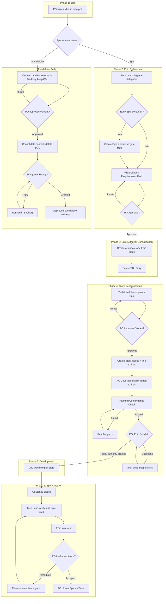

# Planning Workflow: Idea -> Work Item -> Ready -> Done

## Overview

This document defines the planning workflow for ai4X, following established Scrum/SAFe conventions adapted for a small expert team.

- **Ideas** are drafted by the Product Owner (PO) in `adm/pbl/` as a temporary exploration area.
- This workflow uses the canonical Work Item and planning-role definitions in `adm/gdl/glossary.md`.
- A PO-approved roadmap may justify an early Epic container before its Requirements Pack is complete.
- The expert team refines Epics into explicit, testable acceptance criteria, and the Tech Lead decomposes approved Epics into **Stories**.
- Development executes per Story through the 10-stage expert team workflow.
- GitHub Issues are the single source of truth once approved planning content is consolidated there. A PBL entry is deleted only after its approved content is authoritative in the Issue.
- No Issue or container authorizes implementation until its applicable Ready gate has passed.

## Canonical Project Lifecycle

This document is the sole current authority for planning lifecycle status,
gate facts, transitions, and the high-blast-radius Apply gate. The Project
Status field has exactly these options, in this display order:

| Status | GitHub color | Description |
|---|---|---|
| `Backlog` | `GRAY` | Captured for consideration; material preparation has not started. |
| `Refinement` | `BLUE` | Active contract preparation; neither implementation nor authorization. |
| `Ready` | `PURPLE` | Explicitly authorized by the Product Owner and queued for execution. |
| `In progress` | `YELLOW` | Activated from Ready and actively implemented. |
| `Paused` | `ORANGE` | Intentionally suspended with a recorded return condition. |
| `In review` | `PINK` | Implementation complete and awaiting the required gate. |
| `Done` | `GREEN` | Accepted, remotely available when required, and closed. |

`Paused` is an optional side state, not a mandatory phase. An admitted inactive
item that is not Ready is `Backlog`. Active Requirements refinement, Story
decomposition, or Planning Conformance uses `Refinement` with implementation
authority `no`. For an executable item, `In progress` is reserved for
PO-authorized delivery after `Ready`; for a Roadmap it means active
non-executable coordination and never implementation authority.

The closed kind applicability and evidence contract is:

| Kind | Applicable lifecycle | Evidence claim |
|---|---|---|
| Roadmap | `Backlog -> In progress -> In review -> Done`; optional `Paused` from `In progress` or `In review` | Exact PO-approved Plan-bound expected status, Issue state, native child set, and Project identity; `plan-status-only` |
| Epic | `Backlog <-> Refinement -> Ready -> In progress -> In review -> Done`; optional `Paused` from `Refinement`, `Ready`, `In progress`, or `In review` | Canonical five Epic gate facts plus conditional pause facts; `epic-contract-consistency` |
| Story | Executable path as Epic; optional `Paused` from `Refinement`, `Ready`, `In progress`, or `In review` | Exact PO-approved Plan-bound expected status and parent/dependency identities; `plan-status-only` |
| Standalone | Executable path as Epic; optional `Paused` from `Refinement`, `Ready`, `In progress`, or `In review` | Exact PO-approved Plan-bound expected status; `plan-status-only` |

Native Sub-Issues remain hierarchy authority, native blocked-by/blocking
relations remain execution-dependency authority, and manual Board position is
recommended order only. None creates planning or delivery authority.

## Operational Role Projection

> Canonical term definitions: see `adm/gdl/glossary.md` § Planning Terms. The table below states only how each canonical term participates in this workflow.

| Canonical term | Operational use | Responsible actor | PO decision |
|----------------|-----------------|-------------------|-------------|
| **Idea** | Starts temporary intake in `adm/pbl/` | PO | Selects the next planning path or rejects it |
| **Roadmap** | Orders and relates planned work | Tech Lead with PO direction | Approves the roadmap |
| **Epic** | Carries gate facts, the Requirements Pack, and AC coverage | Tech Lead / RE | Approves Requirements, decomposition, Ready, and final acceptance |
| **Story** | Carries approved PR-sized delivery scope | Tech Lead | Approves the decomposition that contains it |
| **Standalone Issue** | Uses the standalone content-promotion and Ready path | Tech Lead | Approves content, Ready, and final acceptance |
| **Task** | Records internal implementation steps | Dev team | None |

### Ownership Rules

1. The PO owns the backlog. No one changes priority without PO approval.
2. The PO writes Ideas. The expert team helps refine, but never overwrites PO intent.
3. The PO may approve a roadmap and the early creation of coherent Epic containers without granting Ready authority.
4. The RE produces the Epic definition (Requirements Pack). The PO approves it.
5. The Tech Lead proposes the Story decomposition. The PO approves it.
6. The PO owns Ready decisions and final acceptance. Issue creation never substitutes for either decision.
7. Tasks are internal to the dev team and do not require PO approval.

### High-Blast-Radius Apply Gate

`Ready` records the PO's authorization of the approved scope. Executable work
enters `In progress` only when authorized delivery begins, without changing
the PO-owned gate facts. `In progress` does not by itself authorize
high-blast-radius mutation.

External, bulk, or otherwise hard-to-reverse mutations require the additional
sequence `Plan -> explicit PO approval -> Apply -> Receipt`. The Plan must bind
the exact target identities, preimages, intended postimages, action order, and
recovery boundary. Apply must stop when those facts drift or cannot be observed
completely. Normal waiting for the Plan's PO approval is not `Paused`; `Paused`
is reserved for genuine suspension of the work.

This section is the sole current complete authority for that additional gate.
Point-of-use documents may reference it but must not restate or weaken it.
Issue #107 owns its one future transfer to the sole target authority at
`.ai4x/operations/planning-workflow.md` and removal of this transitional owner.

### Backlog Curation Principle

A clean Backlog is truthful, ordered, and free of false authority; it is not
defined by the smallest possible number of Issues. `retain` means only that
domain value remains recognizable, no named approved successor owns the
complete remaining outcome, and the Issue stays in Backlog. It grants no
priority, Ready decision, or implementation commitment.

Close or absorb an Issue only after proving that a named existing successor
owns every valuable remaining outcome and preserves source traceability, or
after recording an explicit evidence-bound closure rationale. Before every
later Ready decision, challenge retained work again for current value,
relevance, overlap, and effort; then retain, revise, absorb, defer, or close it
without preserving work by inertia or discarding knowledge without an owner.

Use each GitHub planning mechanism for exactly one meaning. Native Sub-Issues
express hierarchy and ownership beneath an Epic. Native blocked-by/blocking
relations express only genuine execution dependencies. Manual position in the
Status-grouped Board expresses the recommended working order. Do not duplicate
mere ordering as a dependency graph, and do not infer authority from any of
these three projections.

## Phases

### Phase 1: Idea (PO, `adm/pbl/`)

**Scope**: New ideas, vague intents, exploration, and early discussion.

**Artifact**: Markdown file in `adm/pbl/` (temporary, not versioned long-term).

**Status**: `idea`

**Duration**: Days to a few weeks. Goal: reach enough clarity to start refinement.

**Exit**: PO decides to refine the Idea into an Epic (triggers Phase 2), route it to the standalone path, or reject it.

### Phase 2: Epic Container and Refinement (Tech Lead + RE + PO)

**Trigger**: The PO submits an Idea for refinement or approves a roadmap that identifies a coherent planned Epic.

**Process**:
1. Tech Lead triages scope and delegates to Requirements Engineer.
2. The Tech Lead may create an early Epic Issue with label `epic`. Creation is optional until the Requirements Pack is approved.
3. An early Epic container includes and keeps current the canonical Epic Gate Facts Template below.
4. RE works with PO to produce a **Requirements Pack** (= Epic definition):
   - Problem statement
   - In-scope and out-of-scope
   - Constraints and assumptions
   - Acceptance criteria (EARS format)
   - Non-goals
   - Risks and open decisions
5. PO reviews and approves the Requirements Pack.

#### Epic Gate Facts Template

Copy this section into the Epic Issue body. Replace each bracketed choice with exactly one of its listed values and keep the field names unchanged.

```markdown
## Epic gate facts

- Requirements refinement: [not started | in progress | approved]
- Story decomposition: [not started | in progress | approved]
- Planning Conformance: [not run | failed | passed]
- Ready decision: [not granted | granted]
- Implementation authority: [no | yes]
```

These five fields are the sole authority for Requirements, decomposition,
Planning-Conformance, Ready, and implementation facts. Each field and the
section occur exactly once. Requirements and Story decomposition use
`not started | in progress | approved`; Planning Conformance uses
`not run | failed | passed`; Ready uses `not granted | granted`; and
Implementation uses `no | yes`.

Let `P` mean Requirements and Story decomposition are `approved` and Planning
Conformance is `passed`; let `A` mean Ready is `granted` and Implementation is
`yes`. Story decomposition `in progress|approved` requires Requirements
`approved`; Planning Conformance `failed|passed` requires both prior approvals;
Ready is granted exactly when Implementation is yes; either requires `P`.

| Epic Project status | Required gate-fact consistency |
|---|---|
| `Backlog` | not `A`; neither Requirements nor Story decomposition is `in progress` |
| `Refinement` | not `A`; a planning field is `in progress`, or both are approved with Conformance `not run|failed` |
| `Ready`, `In progress`, `In review` | `P` and `A`; Issue open |
| `Paused` | complete Pause facts; underlying facts satisfy `Paused from`; Issue open |
| `Done` | `P` and `A`; no Pause facts; Issue closed |

All non-Done Epics are open. A validator failure reports inconsistency only; it
never selects a replacement state or infers authority.

#### Conditional Pause Facts

While and only while status is `Paused`, the Issue contains exactly one:

```markdown
## Pause facts

- Paused from: [Refinement | Ready | In progress | In review]
- Pause reason: [non-empty concise reason]
- Resume condition: [non-empty observable condition]
```

Pause is only for genuine suspension, never ordinary waiting for PO approval.
On resumption, the item first returns to its recorded `Paused from` state and
the block is removed in the same governed operation. Missing, empty,
duplicated, unsupported, or stale pause facts are invalid.

**Board status**: `Backlog` while inactive, or `Refinement` while Requirements refinement is active. Neither status grants implementation authority.

**Exit**: PO approval of the Requirements Pack. This is the Requirements approval gate.

**Completion Checklist** (Tech Lead must verify before proceeding to Phase 3):

- [ ] Requirements Pack produced (problem, scope, constraints, ACs, non-goals, risks)
- [ ] All ACs testable
- [ ] At least one rejected alternative per major design decision
- [ ] PO reviewed and approved Requirements Pack

### Phase 3: Epic Authority Consolidation (Tech Lead)

**Trigger**: PO approval of Requirements Pack.

**Action**:
1. If no early container exists, the Tech Lead creates a GitHub Issue with label `epic`.
2. If an early container exists, the Tech Lead updates it rather than creating a duplicate.
3. Issue body contains the approved Requirements Pack content and current gate facts.
4. Issue references the original PBL artifact path for traceability.
5. **Delete PBL entry** from `adm/pbl/`. PBL is temporary; GitHub Issues are the single source of truth.

**Status**: Epic Issue is open on GitHub.

**Completion Checklist** (Tech Lead must verify before proceeding to Phase 4):

- [ ] Exactly one Epic Issue exists with label `epic`
- [ ] Issue body contains approved Requirements Pack
- [ ] Gate facts are current and implementation authority remains `no`
- [ ] Issue references its PBL origin path for traceability, if one exists
- [ ] Originating PBL entry deleted from `adm/pbl/`, or marked not applicable
- [ ] Epic added to project board (`Backlog`, or `Refinement` only while planning work is active)

### Phase 4: Story Decomposition (Tech Lead → PO Approval)

**Trigger**: Epic Issue exists on GitHub.

**Process**:
1. Tech Lead decomposes the Epic into Stories based on:
   - Implementable scope (one Story = one PR-sized unit of work)
   - Architecture boundaries and dependencies
   - Acceptance criteria grouping
2. Tech Lead presents the proposed Story breakdown to PO.
3. PO reviews and approves the Story decomposition.

**Action**:
1. Tech Lead creates GitHub Issues with label `story` for each approved Story.
2. Each Story Issue is a native **GitHub Sub-Issue** of the parent Epic (not a task-list or text-only relationship).
3. Each Story Issue contains:
   - Subset of acceptance criteria from the Epic
   - Implementation scope description
   - Link to parent Epic
4. Tech Lead adds an **AC Coverage Matrix** to the Epic Issue body showing which Story covers which acceptance criterion. This matrix is the authoritative traceability artifact for the Epic.
5. After the PO grants Ready, the Tech Lead updates the disclosed gate facts to `Ready decision: granted` and `Implementation authority: yes`.

**Board status**: `Backlog` while inactive, or `Refinement` while Story decomposition or Planning Conformance is active. Implementation authority remains `no`.

**Exit Gate**: After the Requirements Pack and Story decomposition are PO-approved, Story Issues are created and linked, and every Epic acceptance criterion is covered, the Tech Lead must run the Planning Conformance Check (see `adm/gdl/planning-conformance.md`). Only after it passes may the Tech Lead explicitly request the PO's Ready decision for the Epic. No development work may begin until the PO transitions the Epic to Ready. The Tech Lead's prompt must offer support, not just request a binary decision. Example: *"Stories are created and Planning Conformance passed. The Epic is not yet Ready. Would you like to grant Ready authority, or is there anything else I can help you with first?"*

**Completion Checklist** (Tech Lead must verify before issuing Ready-Gate prompt):

- [ ] Story Issues created with label `story`
- [ ] All Stories linked as Sub-Issues to parent Epic
- [ ] All Stories added to project board (status: Backlog)
- [ ] AC Coverage Matrix added to Epic Issue body
- [ ] All Epic ACs covered — no gaps, no orphans
- [ ] Planning Conformance Check passed
- [ ] Gate facts state approved Requirements and Story decomposition, passed Planning Conformance, and no Ready authority yet
- [ ] PO Ready-Gate prompt issued

### Standalone Path: Content Promotion and Ready

**Trigger**: The PO selects standalone handling for an Idea or directly authorizes standalone intake.

**Process**:
1. The Tech Lead creates a standalone Issue in `Backlog` with an appropriate semantic label and copies or references the draft content.
2. If the Issue originated from `adm/pbl/`, the PBL entry remains in place while the standalone content is unapproved.
3. The PO reviews and explicitly approves the standalone scope and content, or requests iteration.
4. After content approval, the Tech Lead makes the approved content authoritative in the Issue and only then deletes the originating PBL entry.
5. The PO may grant Ready in the same decision as content approval or later. If both decisions are combined, the Tech Lead completes content consolidation and PBL deletion before recording the Issue as `Ready`.
6. No standalone implementation begins before the explicit Ready decision.

**Completion Checklist** (Tech Lead must verify before recording Ready):

- [ ] Standalone Issue has an appropriate semantic label and is on the project board
- [ ] PO explicitly approved the standalone scope and content
- [ ] Approved content is authoritative in the standalone Issue
- [ ] Originating PBL entry was retained until content approval, then deleted; or no PBL origin exists
- [ ] PO explicitly granted Ready authority

### Phase 5: Development (Story → PR → Merge)

**Trigger**: The PO grants the applicable Ready authority after all planning prerequisites pass.

**Scope**: Each approved Story follows the 10-stage expert team workflow in `crp/gov/prc/workflow.md`. An Epic container does not execute implementation stages.

**Process**:
1. Tech Lead creates a topic branch (`feat/*`, `fix/*`, etc.) for the Story.
2. The 10-stage dev workflow executes against that Story. The Tech Lead determines in Stage 1 which conditional stages apply.
3. PR is linked to the Story Issue (via `closes #N`).
4. PR description references the parent Epic and summarizes key artifacts for traceability.

**Checks**: `make verify`, applicable Doctor evidence under `crp/gov/prc/workflow.md` (Completion Gate), and GitHub Actions.

### Phase 6: Closure

**Story closure**:
1. PR merged to trunk → Story Issue auto-closes (via `closes #N`).

**Epic closure**:
1. All Story Issues linked to the Epic are closed.
2. The Tech Lead verifies that all Epic acceptance criteria are satisfied and presents the acceptance evidence to the PO without issuing final acceptance.
3. The Tech Lead moves the Epic to `In review` and explicitly requests the PO's final acceptance.
4. The PO either requests remediation or explicitly accepts the completed Epic.
5. Only after explicit PO acceptance does the PO transition the Epic to `Done` and close the Epic Issue.

**Epic Closure Checklist**:

- [ ] All native Story Sub-Issues are closed
- [ ] Tech Lead verification confirms every Epic AC is satisfied
- [ ] Acceptance evidence was presented to the PO
- [ ] Epic is `In review`
- [ ] Explicit PO final acceptance is recorded
- [ ] PO transitioned the Epic to `Done` and closed it

## Policy

| Aspect | Decision |
|--------|----------|
| **Work-item model** | Use the canonical Work Item and planning-role definitions in `adm/gdl/glossary.md`; this workflow governs their transitions and artifacts. |
| **Epic path** | Required when a coherent outcome needs coordinated Stories and Epic-level AC coverage; otherwise work may remain standalone. |
| **Early Epic container** | Allowed for a coherent Epic identified by a PO-approved roadmap. It must disclose all gate facts and grants no implementation authority. |
| **Standalone Issue path** | The Tech Lead may create labeled standalone work in `Backlog`, but retains any originating PBL entry until the PO approves the content and that content is authoritative in the Issue. Ready requires a separate explicit PO decision, which may be combined with content approval. Development stages apply per Stage Applicability rules. |
| **Story linkage** | Every Story must link to a parent Epic via GitHub Sub-Issues. |
| **AC traceability** | Every Epic must contain an AC Coverage Matrix mapping each acceptance criterion to its covering Story. |
| **PBL retention** | Temporary only. Delete after its approved content becomes authoritative in a GitHub Issue. No archive. |
| **Single source of truth** | GitHub Issues after approved planning content is consolidated there. PBL is draft-only. |
| **PO control** | PO approves Epic content, Story decomposition, Ready authority, priority, and final acceptance. |
| **Backlog priority** | Only the PO sets and changes priority. |
| **Issue labels** | Apply the semantic roles defined in `adm/gdl/glossary.md` using the label conventions in `adm/gdl/board-policy.md`. |
| **Issue linkage** | Every Story is a native Sub-Issue of its Epic. Standalone Issues have no required Epic parent. |
| **Tracking board** | GitHub Project `#3` ([link](https://github.com/users/normenmueller/projects/3)). All Epics, Stories, and standalone Issues must be tracked there. Public visibility. |

Board transitions, ownership gates, and label definitions: see `adm/gdl/board-policy.md`.

> **Projection note**: `board-policy.md` references this sole lifecycle authority and projects its board mechanics without redefining it.

### Read-only lifecycle verification

`utl/gh/planning-verify.mjs` enforces this authority without becoming another
authority. Its exact digest-bound expected Plan entry includes `kind` as one of
`roadmap|epic|story|standalone`, repository, Project, Issue, Project item,
Status-field IDs, and expected status. Runtime kind must equal expected kind
before kind-specific validation. Epic success claims only
`epic-contract-consistency`; all other success claims only `plan-status-only`.
Every success has `authorityEffect: "none"` and proves no Ready,
implementation, acceptance, Done, priority, transition, publication, or
mutation authority. The validator is deterministic, read-only, and never
offers an apply or transition operation.

## Visual Flow

### Planning Flow (Idea -> Epic -> Stories)



## Verification

1. Run one end-to-end dry run: Idea in PBL → Epic refinement → Epic Issue → Story decomposition → Story Issues → PR → merge → Tech Lead verification → explicit PO final acceptance → PO closure.
2. Confirm an early Epic container can exist before Requirements approval and discloses all five gate facts.
3. Confirm the PBL entry is deleted only after the approved Requirements Pack becomes authoritative in the Epic Issue.
4. Confirm Story Issues are native Sub-Issues of the parent Epic.
5. Confirm planning uses `Refinement`, container creation creates no authority, and executable `In progress` is authorized delivery only.
6. Confirm Ready is unavailable until Requirements approval, Story approval, complete AC coverage, and passed Planning Conformance.
7. Confirm traceability chain: Epic Issue -> Story Issue -> PR -> merged commit.
8. Confirm `make verify`, all applicable Doctor and Capability evidence under `crp/gov/prc/workflow.md` (Completion Gate), and GitHub Actions remain green.
9. Confirm an originating standalone PBL entry survives Issue creation and is deleted only after explicit PO content approval and authoritative consolidation.
10. Confirm standalone changes can proceed without mandatory Epic/Story linkage only after their own explicit Ready decision.
11. Confirm Epic closure requires recorded PO final acceptance and PO transition to `Done`; Tech Lead verification alone is insufficient.
12. Confirm each delivery branch starts at its exact Base Authorization OID and the current pull request has a fresh Branch and Pull-Request Scope reconciliation after creation or base/head change, before `Ready for review`, before `In review`, and at final conformance. Prior proofs are consumed, not treated as evergreen; moved-base recovery preserves the original branch and PR and retains an exact digest-bound predecessor lineage unless the PO explicitly authorizes destructive action.
13. Confirm governed planning transitions run explicit live read-only verification and preserve its result as transition evidence.

## Lifecycle Activation and Recovery

Changing the Project Status schema or initial items uses one exact,
digest-bound, explicitly PO-approved Plan. Apply re-observes each preimage,
performs the smallest ordered mutation set, verifies each postimage, stops at
the first failure, and publishes a complete Receipt.

Activation order is `A0` complete read-only preflight; `A1` install the exact
seven-option schema; `A2` retain #101 as Roadmap `In progress`; `A3` retain
#135-#139 individually as Story `Backlog`; `A4` retain #109 as standalone
`In progress` only after separate Ready and implementation grants; `A5`
normalize #102 to exactly one Epic gate section containing Requirements
`approved`, Story decomposition `approved`, Planning Conformance `not run`,
Ready `not granted`, and Implementation `no`, plus exactly one Pause block
whose origin is `Refinement`, reason is `Lifecycle/governance sequencing
suspends #102.`, and condition is `Issues #109, #128, #121, #131, and #122 are
all Done.`; `A6` move #102 to `Paused` only after re-observing that exact A5
postimage; and `A7` re-observe the complete postimage.

On failure, later actions remain pending. Reverse only an exact still-observed
mutation, in reverse dependency order, when no later completed action depends
on it. Otherwise preserve observed state and require a separately PO-approved,
digest-bound forward-Recovery Plan. Every Apply, rollback, or recovery Receipt
binds Plan/approval digests, actor/time, IDs, before/after fingerprints and
postchecks, predecessor/recovery references, and exactly one classification
per action: `completed|rolled back|preserved|failed|pending`.

| Failure point | Immediate disposition | Authorized recovery |
|---|---|---|
| A0 or any preimage check | Failed action; every later action pending; no write | Correct facts and obtain a new or reaffirmed Plan digest. |
| A1 schema mutation or postcheck | Stop and classify observed A1 | Roll back only if the exact old schema is fully observed and restorable and no later action completed; otherwise preserve and use forward Recovery. |
| A2-A4 retained-state check | Stop; prior writes remain candidates for reverse recovery | Reverse completed writes in dependency order only while each exact preimage is observed; otherwise preserve and use forward Recovery. |
| A5 body mutation or postcheck | Stop before A6 | Restore the exact body preimage only when A5's current postimage is exact and no later action depends on it; then consider A1 reversal; otherwise preserve and use forward Recovery. |
| A6 status mutation or postcheck | Stop before A7 | Reverse A6, then A5, then A1 only while each current postimage is exact and every later dependency has reversed; otherwise preserve and use forward Recovery. |
| A7 aggregate check or observation drift | Stop; make no mutation from an uncertain snapshot | Preserve observed state and require explicit PO approval of a new digest-bound forward-Recovery Plan. |

Issue #107 transfers this contract exactly once to
`.ai4x/operations/planning-workflow.md`, redirects projections, removes this
transitional owner, and retires or moves obsolete enforcement only after its
replacement passes the same fixtures. The migration Receipt must prove that
no interval or final state has two lifecycle authorities.

## References

- `adm/gdl/board-policy.md` — Board transitions, ownership gates, and label conventions.
- `adm/gdl/planning-conformance.md` — Planning conformance check (mandatory before Ready-Gate).
- `crp/gov/prc/workflow.md` — 10-stage expert team routing, branching, commits, and completion gates.
- `utl/gh/RUNBOOK.md` — deterministic Branch and Pull-Request Scope preflight and evidence lifecycle.
- `.github/agents/ai4x.agent.md` — Tech Lead definition, interaction model, and product rules.
- `CONTRIBUTING.md` — informative contributor guidance.
