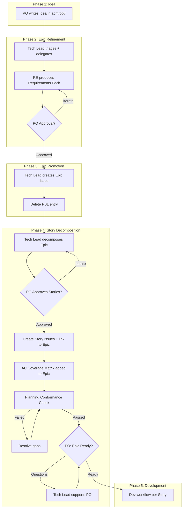

# Planning Workflow: Idea → Epic → Story → Done

## Overview

This document defines the planning workflow for ai4X, following established Scrum/SAFe conventions adapted for a small expert team.

- **Ideas** are drafted by the Product Owner (PO) in `adm/pbl/` as a temporary exploration area.
- The expert team refines Ideas into **Epics** with explicit acceptance criteria.
- The Tech Lead decomposes approved Epics into **Stories** (GitHub Issues).
- Development executes per Story through the 10-stage expert team workflow.
- GitHub Issues are the single source of truth once promoted. PBL entries are deleted after promotion.

## Work Item Hierarchy

> Canonical term definitions: see `adm/gdl/glossary.md` § Planning Terms.

| Level | What | Who creates | Who approves | GitHub representation |
|-------|------|-------------|-------------|----------------------|
| **Idea** | Vague intent, exploration | PO | — | `adm/pbl/*.md` (temporary) |
| **Epic** | Refined scope with acceptance criteria | RE (from Idea) | PO | Issue with label `epic` |
| **Story** | Implementable unit of work | Tech Lead (from Epic) | PO | Issue with label `story`, linked to Epic |
| **Task** | Implementation step within a Story | Dev team (implicit) | — | Checklist within Story Issue |

### Ownership Rules

1. The PO owns the backlog. No one changes priority without PO approval.
2. The PO writes Ideas. The expert team helps refine, but never overwrites PO intent.
3. The RE produces the Epic definition (Requirements Pack). The PO approves it.
4. The Tech Lead proposes the Story decomposition. The PO approves it.
5. Tasks are internal to the dev team and do not require PO approval.

## Phases

### Phase 1: Idea (PO, `adm/pbl/`)

**Scope**: New ideas, vague intents, exploration, and early discussion.

**Artifact**: Markdown file in `adm/pbl/` (temporary, not versioned long-term).

**Status**: `idea`

**Duration**: Days to a few weeks. Goal: reach enough clarity to start refinement.

**Exit**: PO decides to refine the Idea into an Epic (triggers Phase 2) or rejects it.

### Phase 2: Epic Refinement (RE + PO)

**Trigger**: PO submits Idea to the Tech Lead for refinement.

**Process**:
1. Tech Lead triages scope and delegates to Requirements Engineer.
2. RE works with PO to produce a **Requirements Pack** (= Epic definition):
   - Problem statement
   - In-scope and out-of-scope
   - Constraints and assumptions
   - Acceptance criteria (EARS format)
   - Non-goals
   - Risks and open decisions
3. PO reviews and approves the Requirements Pack.

**Status**: `ready-for-promotion`

**Exit**: PO approval of the Requirements Pack. This is the promotion gate.

**Completion Checklist** (Tech Lead must verify before proceeding to Phase 3):

- [ ] Requirements Pack produced (problem, scope, constraints, ACs, non-goals, risks)
- [ ] All ACs testable
- [ ] At least one rejected alternative per major design decision
- [ ] PO reviewed and approved Requirements Pack

### Phase 3: Epic Promotion (Tech Lead)

**Trigger**: PO approval of Requirements Pack.

**Action**:
1. Tech Lead creates a GitHub Issue with label `epic`.
2. Issue body contains the approved Requirements Pack content.
3. Issue references the original PBL artifact path for traceability.
4. **Delete PBL entry** from `adm/pbl/`. PBL is temporary; GitHub Issues are the single source of truth.

**Status**: Epic Issue is open on GitHub.

**Completion Checklist** (Tech Lead must verify before proceeding to Phase 4):

- [ ] Epic Issue created with label `epic`
- [ ] Issue body contains approved Requirements Pack
- [ ] Issue references PBL origin path for traceability
- [ ] PBL entry deleted from `adm/pbl/`
- [ ] Epic added to project board (status: Backlog)

### Phase 4: Story Decomposition (Tech Lead → PO Approval)

**Trigger**: Epic Issue exists on GitHub.

**Process**:
1. Tech Lead decomposes the Epic into Stories based on:
   - Implementable scope (one Story = one PR-sized unit of work)
   - Architecture boundaries and dependencies
   - Acceptance criteria grouping
2. Tech Lead presents the proposed Story breakdown to PO.
3. PO reviews and approves the Story decomposition.

**Action**:
1. Tech Lead creates GitHub Issues with label `story` for each approved Story.
2. Each Story Issue is linked to the parent Epic Issue as a **GitHub Sub-Issue** (not via task lists or text references).
3. Each Story Issue contains:
   - Subset of acceptance criteria from the Epic
   - Implementation scope description
   - Link to parent Epic
4. Tech Lead adds an **AC Coverage Matrix** to the Epic Issue body showing which Story covers which acceptance criterion. This matrix is the authoritative traceability artifact for the Epic.

**Exit Gate**: After Story Issues are created and linked, the Tech Lead must run the Planning Conformance Check (see `adm/gdl/pln/protocols/planning-conformance.md`) and then explicitly request the PO's Ready decision for the Epic. No development work may begin until the PO transitions the Epic to Ready. The Tech Lead's prompt must offer support, not just request a binary decision. Example: *"Stories are created. The Epic is in Backlog. Your decision: set the Epic to Ready, or is there anything else I can help you with first?"*

**Completion Checklist** (Tech Lead must verify before issuing Ready-Gate prompt):

- [ ] Story Issues created with label `story`
- [ ] All Stories linked as Sub-Issues to parent Epic
- [ ] All Stories added to project board (status: Backlog)
- [ ] AC Coverage Matrix added to Epic Issue body
- [ ] All Epic ACs covered — no gaps, no orphans
- [ ] Planning Conformance Check passed
- [ ] PO Ready-Gate prompt issued

### Phase 5: Development (Story → PR → Merge)

**Scope**: Each Story follows the 10-stage expert team workflow in `crp/gov/prc/workflow.md`.

**Process**:
1. Tech Lead creates a topic branch (`feat/*`, `fix/*`, etc.) for the Story.
2. The 10-stage dev workflow executes against that Story. The Tech Lead determines in Stage 1 which conditional stages apply.
3. PR is linked to the Story Issue (via `closes #N`).
4. PR description references the parent Epic and summarizes key artifacts for traceability.

**Checks**: `make verify`, `make doctor`, GitHub Actions workflow.

### Phase 6: Closure

**Story closure**:
1. PR merged to trunk → Story Issue auto-closes (via `closes #N`).

**Epic closure**:
1. All Story Issues linked to the Epic are closed.
2. Tech Lead verifies Epic acceptance criteria are fully covered.
3. Tech Lead closes the Epic Issue.

## Policy

| Aspect | Decision |
|--------|----------|
| **Work item hierarchy** | Idea → Epic → Story → Task (standard Scrum/SAFe). |
| **Epic promotion** | Mandatory for Features and Fixes. Optional for Docs, Chore, and Refactor. |
| **Standalone Issue path** | For Docs/Chore/Refactor without Epic promotion: the Tech Lead creates a GitHub Issue with label `chore`, `docs`, or `refactor`, adds it to the board (Backlog), and deletes the PBL entry. The PO sets the Issue to Ready before the Tech Lead may begin work. The development workflow stages apply per Stage Applicability rules. |
| **Story linkage** | Every Story must link to a parent Epic via GitHub Sub-Issues. |
| **AC traceability** | Every Epic must contain an AC Coverage Matrix mapping each acceptance criterion to its covering Story. |
| **PBL retention** | Temporary only. Delete after promotion to GitHub Issue (Epic or standalone). No archive. |
| **Single source of truth** | GitHub Issues once promoted. PBL is draft-only. |
| **PO control** | PO approves: Epic content, Story decomposition, and final acceptance. |
| **Backlog priority** | Only the PO sets and changes priority. |
| **Issue labels** | `epic` and `story` are mandatory. Additional labels optional. |
| **Issue linkage** | Mandatory for Features/Fixes. Optional for Docs/Chore/Refactor. |
| **Tracking board** | GitHub Project `#3` ([link](https://github.com/users/normenmueller/projects/3)). All Epics, Stories, and standalone Issues must be tracked there. Private visibility. |

Board transitions, ownership gates, and label definitions: see `adm/gdl/shr/protocols/board-policy.md`.

> **Note**: Mutual reference — `board-policy.md` references this document for phase definitions. Neither is subordinate; they are complementary protocols with distinct scope (planning lifecycle vs. board mechanics).

## Visual Flow

### Planning Flow (Idea → Epic → Stories)

## Verification

1. Run one end-to-end dry run: Idea in PBL → Epic refinement → Epic Issue → Story decomposition → Story Issues → PR → merge → closure.
2. Confirm PBL entry is deleted after Epic promotion.
3. Confirm Story Issues link to parent Epic Issue.
4. Confirm traceability chain: Epic Issue → Story Issue → PR → merged commit.
5. Confirm `make verify`, `make doctor`, and GitHub Actions remain green.
6. Confirm non-Feature/Fix changes (Docs, Chore, Refactor) can proceed without mandatory Epic/Story linkage.

## References

- `adm/gdl/shr/protocols/board-policy.md` — Board transitions, ownership gates, and label conventions.
- `adm/gdl/pln/protocols/planning-conformance.md` — Planning conformance check (mandatory before Ready-Gate).
- `crp/gov/prc/workflow.md` — 10-stage expert team routing, branching, commits, and completion gates.
- `.github/agents/ai4x.agent.md` — Tech Lead definition, interaction model, and product rules.
- `CONTRIBUTING.md` — informative contributor guidance.
