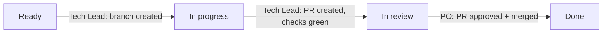

# Board Policy

## Purpose

Define status transitions, ownership gates, and label conventions for the ai4X tracking board.

## Scope

Applies to all Epics, Stories, and standalone Issues tracked on GitHub Project `#3` ([link](https://github.com/users/normenmueller/projects/3)). Private visibility.

## Ownership Principle (MUST)

PO controls intake gates (Ready for Epics and standalone Issues) and final acceptance (Done). Tech Lead controls execution transitions (In progress, In review).

## Issue Delivery (MUST)

All Issues — Stories, Epics' sub-issues, and standalone Issues alike — follow the same delivery lifecycle once they reach Ready. This is standard GitHub Flow.

| Transition | Owner | Prerequisites |
|------------|-------|---------------|
| **Ready → In progress** | Tech Lead | Topic branch created (`feat/*`, `fix/*`, `docs/*`, `chore/*`, or `refactor/*`). |
| **In progress → In review** | Tech Lead | PR created and linked to Issue (`closes #N`). Applicable checks green. |
| **In review → Done** | PO | PO reviews and approves the PR. Merge closes the Issue. |

### Issue Delivery Lifecycle

## Issue Intake

Issue intake defines how an Issue reaches Ready. This differs by type.

### Epic Intake

| Transition | Owner | Prerequisites |
|------------|-------|---------------|
| → **Backlog** | Tech Lead | Epic Issue created after PO approval of Requirements Pack (Phase 2 exit gate). |
| **Backlog → Ready** | PO | Acceptance criteria are complete and testable. PO confirms release for development. Planning conformance check passed (see `adm/gdl/pln/protocols/planning-conformance.md`). |

### Epic Delivery

| Transition | Owner | Prerequisites |
|------------|-------|---------------|
| **Ready → In progress** | Tech Lead | First Story of the Epic enters In progress. |
| **In progress → In review** | Tech Lead | All Stories are Done or In review. Final acceptance pending. |
| **In review → Done** | PO | PO confirms final acceptance of all Epic ACs across all Stories. |

### Story Intake

| Transition | Owner | Prerequisites |
|------------|-------|---------------|
| → **Backlog** | Tech Lead | Story Issue created. Linked as Sub-Issue to parent Epic. |
| **Backlog → Ready** | Tech Lead | Implicitly Ready when parent Epic is Ready and Story decomposition is PO-approved. |

### Standalone Issue Intake (Docs, Chore, Refactor)

| Transition | Owner | Prerequisites |
|------------|-------|---------------|
| → **Backlog** | Tech Lead | Issue created with label `chore`, `docs`, or `refactor`. PBL entry deleted. |
| **Backlog → Ready** | PO | PO confirms scope and releases for development. |

## GitHub Labels

The following labels must exist in the repository:

| Label | Color | Description |
|-------|-------|-------------|
| `epic` | `#3E4B9E` | Epic: refined requirement scope with acceptance criteria |
| `story` | `#0E8A16` | Story: implementable unit of work within an Epic |
| `blocked` | `#D93F0B` | Blocked: cannot proceed, requires action |

Additional labels (optional but recommended):

| Label | Color | Description |
|-------|-------|-------------|
| `chore` | `#C5DEF5` | Chore: maintenance, governance, or housekeeping work |
| `docs` | `#C5DEF5` | Documentation work |
| `refactor` | `#C5DEF5` | Refactoring without behavior change |
| `curate` | `#FBCA04` | Related to the curate sub-command |
| `spawn` | `#FBCA04` | Related to the spawn sub-command |
| `doctor` | `#FBCA04` | Related to the doctor sub-command |

## References

- `adm/gdl/pln/protocols/workflow.md` — Phase definitions and completion checklists.
- `adm/gdl/pln/protocols/planning-conformance.md` — Planning conformance check.
- `adm/gdl/dev/protocols/workflow.md` — 10-stage development workflow (Story execution).
