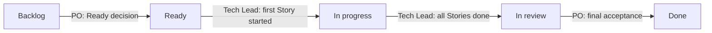
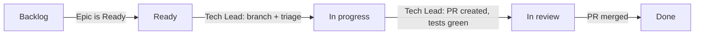

# Board Policy

## Purpose

Define status transitions, ownership gates, and label conventions for the ai4X tracking board.

## Scope

Applies to all Epics and Stories tracked on GitHub Project `#3` ([link](https://github.com/users/normenmueller/projects/3)). Private visibility.

## Ownership Principle (MUST)

PO controls Epic gates (Ready, Done). Tech Lead controls all Story transitions and Epic execution gates (In progress, In review).

## Epic Transitions

| Transition | Owner | Prerequisites |
|------------|-------|---------------|
| → **Backlog** | Tech Lead | Epic Issue created after PO approval of Requirements Pack (Phase 2 exit gate). |
| **Backlog → Ready** | PO | Acceptance criteria are complete and testable. PO confirms release for development. Planning conformance check passed (see `adm/gdl/pln/protocols/planning-conformance.md`). |
| **Ready → In progress** | Tech Lead | Story decomposition is PO-approved. First Story is started. |
| **In progress → In review** | Tech Lead | All Stories are Done. AC Coverage Matrix is complete. All Story tests are green. |
| **In review → Done** | PO | PO confirms final acceptance of all ACs. |

### Epic Lifecycle

## Story Transitions

All Story transitions are owned by the Tech Lead.

| Transition | Prerequisites |
|------------|---------------|
| → **Backlog** | Story Issue created. Linked as Sub-Issue to parent Epic. |
| **Backlog → Ready** | Implicitly Ready when parent Epic is Ready and Story decomposition is PO-approved. |
| **Ready → In progress** | Topic branch is created. Dev Workflow Stage 1 (Triage and Scope) is started. |
| **In progress → In review** | PR is created and linked to the Issue (`closes #N`). TDD cycle is complete: all Story tests are written and green. `make verify` is green. |
| **In review → Done** | PR is merged to trunk. Issue auto-closed via `closes #N`. |

### Story Lifecycle

## GitHub Labels

The following labels must exist in the repository:

| Label | Color | Description |
|-------|-------|-------------|
| `epic` | `#3E4B9E` | Epic: refined requirement scope with acceptance criteria |
| `story` | `#0E8A16` | Story: implementable unit of work within an Epic |
| `blocked` | `#D93F0B` | Blocked: cannot proceed, requires action |

Additional labels (optional but recommended):

| Label | Color | Description |
|-------|-------|-------------|
| `curate` | `#FBCA04` | Related to the curate sub-command |
| `spawn` | `#FBCA04` | Related to the spawn sub-command |
| `doctor` | `#FBCA04` | Related to the doctor sub-command |

## References

- `adm/gdl/pln/protocols/workflow.md` — Phase definitions and completion checklists.
- `adm/gdl/pln/protocols/planning-conformance.md` — Planning conformance check.
- `adm/gdl/dev/protocols/workflow.md` — 10-stage development workflow (Story execution).
