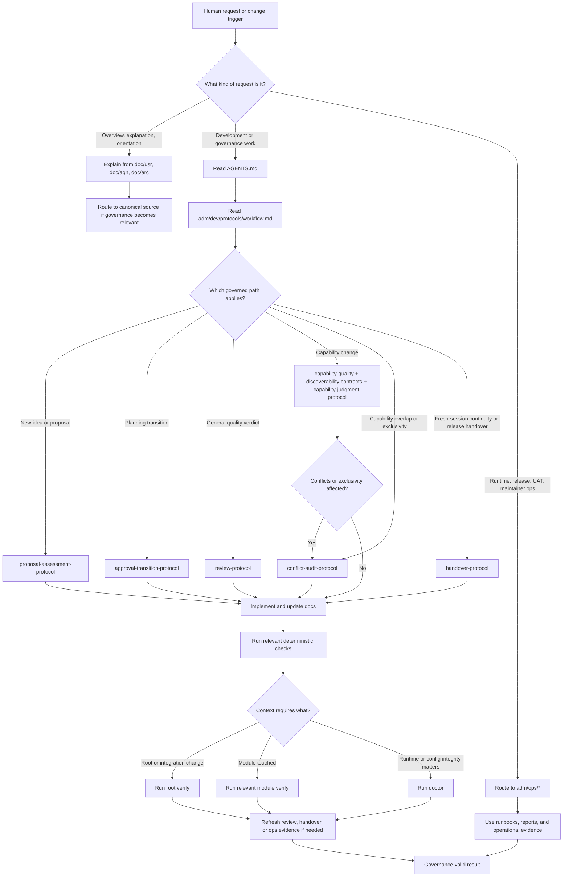

# ai4X Flow

## Purpose

This document explains the full ai4X flow from bootstrap to governed execution, deterministic validation, handover, and operations routing.
Use it when an agent must explain what happens first, what becomes binding when, which checks are expected, and which source governs the next step.

This file is explanatory and reviewable.
It does not replace `AGENTS.md`, `adm/dev/protocols/workflow.md`, task-specific protocols, development contracts, or `adm/ops/*`.

## Audience

Use this document when the human primarily wants to:

- understand the complete ai4X lifecycle from A to Z
- ask which protocol applies when
- ask when `verify`, `doctor`, or module-local checks are expected
- ask when capability contracts become binding
- understand how development, review, handover, planning, and operations fit together

## Canonical Sources

Read or cite these sources in this order when needed:

1. [`../../AGENTS.md`](../../AGENTS.md)
2. [`../../adm/dev/protocols/workflow.md`](../../adm/dev/protocols/workflow.md)
3. [`../../adm/dev/contracts/capability-quality.md`](../../adm/dev/contracts/capability-quality.md)
4. [`../../adm/dev/contracts/capability-discoverability.md`](../../adm/dev/contracts/capability-discoverability.md)
5. [`../../adm/dev/protocols/capability-judgment.md`](../../adm/dev/protocols/capability-judgment.md)
6. [`../../adm/dev/protocols/handover.md`](../../adm/dev/protocols/handover.md)
7. [`../../adm/ops/runbooks/UAT.md`](../../adm/ops/runbooks/UAT.md)

## A-to-Z Flow Overview

The ai4X flow is:

1. classify the request
2. decide whether the request is explanatory, development-governed, or operations-governed
3. if development-governed, follow the bootstrap chain:
   - `AGENTS.md`
   - `adm/dev/protocols/workflow.md`
   - the required task-specific protocol
4. apply any required contract before execution
5. run the relevant deterministic checks before commit, merge, release, or productive usage
6. refresh review, handover, or operational evidence when the task requires it

Work is governance-valid only when:

- the bootstrap chain was followed explicitly
- the correct protocol path was identified first
- required contracts were applied
- relevant deterministic gates are green
- affected documentation was updated consistently

Work is incomplete when any of those conditions is still missing.

## Mermaid Flowchart

## Trigger -> Governance Path Matrix

| Trigger | Canonical source | When it becomes binding | Expected checks or evidence |
| --- | --- | --- | --- |
| overview or explanation request | `doc/usr/*`, `doc/agn/*`, `doc/arc/*` | when the human asks for understanding instead of governed execution | correct routing; no governance improvisation |
| governance-structure explanation | [`./governance-model.md`](./governance-model.md) | when the human asks what belongs in `AGENTS.md`, `adm/dev/*`, or `adm/ops/*` | align explanation with `AGENTS.md` and `workflow.md` |
| new idea or raw proposal | [`../../adm/dev/protocols/proposal-assessment.md`](../../adm/dev/protocols/proposal-assessment.md) | when work starts from `adm/pln/inbox/` or a draft proposal | assessed proposal with explicit decision proposal |
| planning transition or roadmap movement | [`../../adm/dev/protocols/approval-transition.md`](../../adm/dev/protocols/approval-transition.md) | when artifacts move across planning states or roadmap slots change | approval trace, folder/status alignment, roadmap consistency, accepted-task `## Plan` prompt for future `assessed -> accepted` transitions |
| general review request | [`../../adm/dev/protocols/review.md`](../../adm/dev/protocols/review.md) | when a neutral quality verdict is requested | evidence-based review output; relevant gates and source evidence |
| capability creation, rename, split, move, retire, or semantic change | [`../../adm/dev/contracts/capability-quality.md`](../../adm/dev/contracts/capability-quality.md) plus [`../../adm/dev/contracts/capability-discoverability.md`](../../adm/dev/contracts/capability-discoverability.md) plus [`../../adm/dev/protocols/capability-judgment.md`](../../adm/dev/protocols/capability-judgment.md) | when capability quality, discoverability, placement, or action must be judged | criterion-by-criterion judgment, discoverability/applicability judgment, placement decision, action decision |
| capability overlap, trigger collision, exclusivity question, or unclear applicability boundary | [`../../adm/dev/protocols/conflict-audit.md`](../../adm/dev/protocols/conflict-audit.md) | when `requires/conflicts`, trigger neighbors, selection-surface boundaries, or semantic overlap may matter | conflict audit with metadata consequence, discoverability boundary judgment, and evidence basis |
| major change, release prep, or fresh-session continuity need | [`../../adm/dev/protocols/handover.md`](../../adm/dev/protocols/handover.md) | when a fresh agent must continue without hidden session knowledge or release prep needs reboot evidence | refreshed `adm/ops/reports/handover.md` as a live-state continuity artifact with current live-context blocks |
| runtime, release, UAT, repo-ops, maintainer operations | `adm/ops/*` | when the task is operational rather than development-routed | runbooks, reports, operational evidence, often `doctor` and UAT commands |

## Deterministic Checks and When They Run

### Root `verify`

Run `npm --prefix ./utl/ai4x/src run verify` when:

- root ai4X code or documentation changed materially
- integration or governance docs changed and path or metadata checks may be affected
- review, merge, or release preparation needs fresh deterministic evidence

### Module-local `verify`

Run the relevant module gate when a module is touched:

- `npm --prefix ./mod/ask/src run verify`
- `npm --prefix ./mod/kob/utl/kob/src run verify`
- `make -C ./mod/cap/cog verify`
- `make -C ./mod/cap/tec verify`

Run only the relevant module gates, plus the root gate when integration or cross-module docs changed.

### `doctor`

Run `ai4x doctor --strict` when:

- validating a local environment before productive usage
- checking runtime or configuration integrity
- validating the suite before and after `ai4x install --clean`
- running or repeating UAT

Use `doctor` in addition to `verify` when runtime integrity matters.
`verify` validates deterministic repository-level contracts.
`doctor` validates environment and runtime integrity.

### Other Deterministic Checks

Also run these when relevant:

- `bash ./utl/gh/repo-metadata.sh --check-local` when metadata reproducibility matters
- link and path validation indirectly through root or module `verify`
- UAT-specific machine-readable doctor gate from [`../../adm/ops/runbooks/UAT.md`](../../adm/ops/runbooks/UAT.md)

## Capability Flow

Capability governance starts when:

- a capability is created
- a capability is renamed, split, moved, or retired
- capability semantics or metadata change
- composition or portfolio boundaries are affected

Required governed path:

1. `AGENTS.md`
2. `workflow.md`
3. `capability-quality.md`
4. `capability-discoverability.md`
5. `capability-judgment.md`
6. `conflict-audit.md` when overlap, trigger collision, exclusivity, or applicability boundaries may matter

In ai4X, capability composability and quality gates are treated as a move from formally correct artifacts to semantically robust reusable contracts.

Capability-related development work is incomplete unless:

1. the capability-quality contract was applied
2. the capability-discoverability contract was applied
3. the explicit placement decision was documented
4. the explicit action decision was documented
5. real conflicts were audited where exclusivity or applicability boundaries could matter

Typical capability action sequence:

1. identify the capability trigger
2. identify the positive and negative applicability boundary
3. judge quality and discoverability criteria
4. verify that `Trigger` stays a semantic activation situation rather than a slash command or client invocation
5. compare the candidate to the nearest semantic neighbors and name the primary semantic owner
6. decide placement (`ccp|tcp|governance|split`)
7. decide action (`keep|sharpen|split|move|drop`)
8. run conflict audit when needed
9. implement the approved change
10. run relevant module and/or root deterministic gates

## Planning and Transition Flow

Planning starts in `adm/pln/inbox/`.

Sequence:

1. a draft proposal appears in `adm/pln/inbox/`
2. `proposal-assessment.md` sharpens it into a decision-ready artifact
3. proposal assessment must end with an explicit decision proposal
4. no transition into `accepted/` and no roadmap change is valid without explicit approval
5. future `assessed -> accepted` transitions must generate an accepted task with `# Content` plus a `## Plan` section containing one directly copy-pasteable `/plan ...` prompt
6. `approval-transition.md` governs the actual transition across `assessed`, `accepted`, `rejected`, `realized`, and roadmap slots

Planning work is incomplete when:

- the source artifact is in the wrong folder/state
- the decision proposal is missing
- approval evidence is missing
- roadmap slot and task status do not align
- a future accepted task is missing the required `## Plan` prompt

## Review and Handover Flow

### Review

Use `review.md` when:

- a neutral quality verdict is required
- a change package must be assessed before merge or release
- documentation, software, or capability quality must be judged holistically

Typical review flow:

1. follow the bootstrap chain
2. gather evidence across software, docs, governance, and operations as required by scope
3. run relevant deterministic gates
4. issue findings-first review output

### Handover

Use `handover.md` when:

- the suite or a major module changed materially
- a fresh agent must continue without session history
- release preparation requires refreshed reboot evidence

Typical handover flow:

1. follow the bootstrap chain
2. gather governance, system map, runtime, domain, and live-state inputs
3. refresh `adm/ops/reports/handover.md` as a fresh-session live-state continuity artifact rather than as a general project primer
4. include live-context blocks for repo state, roadmap focus, quality evidence, governance snapshot, and external dependency register

## Operations Flow

Use `adm/ops/*` when the task is operational rather than development-routed.

This includes:

- UAT
- release or go-live preparation
- repo metadata and maintainer operations
- operational recovery
- reboot context as an operational artifact

Typical operations sequence:

1. identify the operational task
2. route into the relevant runbook or report
3. run the required operational commands
4. capture operational evidence
5. re-check `doctor`, UAT, metadata, or reboot context as required

For suite-wide acceptance, the UAT baseline is:

1. `ai4x doctor --strict`
2. `ai4x install --clean`
3. `ai4x doctor --strict`
4. machine-readable doctor JSON gate

## Common Misreadings

Avoid these mistakes:

1. treating `doc/agn/*` as a replacement for governance
2. treating `workflow.md` as if it alone governs every task without the task-specific protocol
3. treating `verify` as a substitute for `doctor`
4. treating `doctor` as a substitute for review or capability judgment
5. treating capability work as ordinary review without the capability-quality contract
6. treating `requires` or `conflicts` as substitutes for explicit applicability boundaries
7. treating operations work as if it should still be routed through development protocols only

## Do Not Do

- Do not infer the applicable protocol from repository layout alone.
- Do not start governed implementation before the bootstrap chain is complete.
- Do not move planning artifacts without explicit approval where required.
- Do not treat capability changes as complete without placement and action decisions.
- Do not treat empty `do_not_use_when` or `distinguish_from` as automatically correct without checking neighbor ambiguity.
- Do not claim governance-valid completion while relevant deterministic gates are still missing or red.
